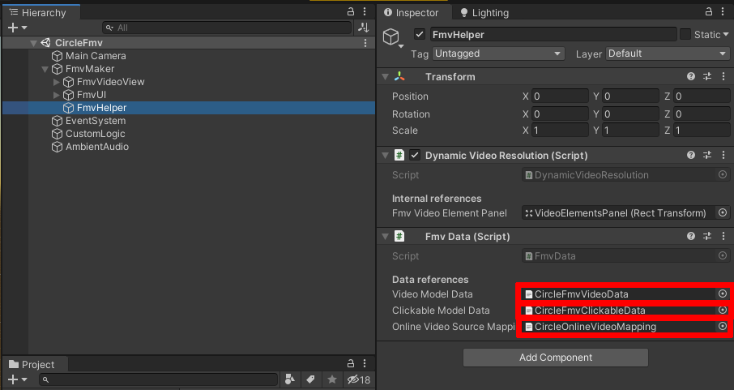
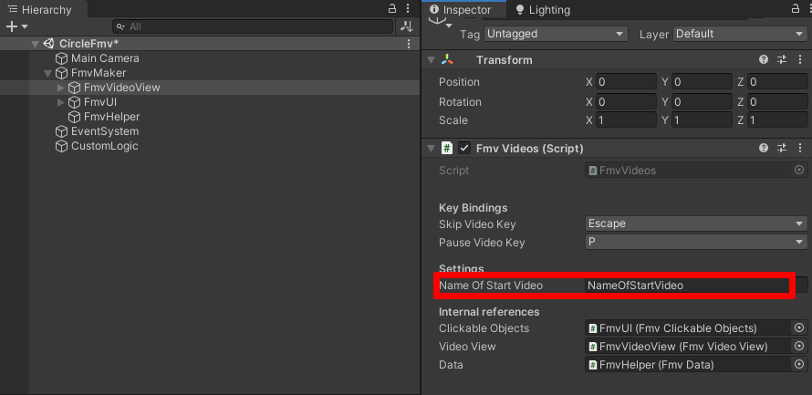
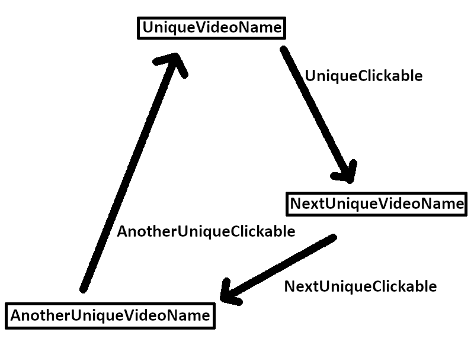
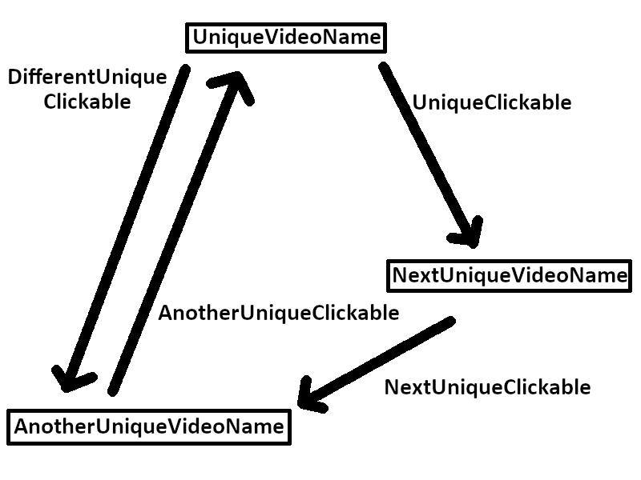
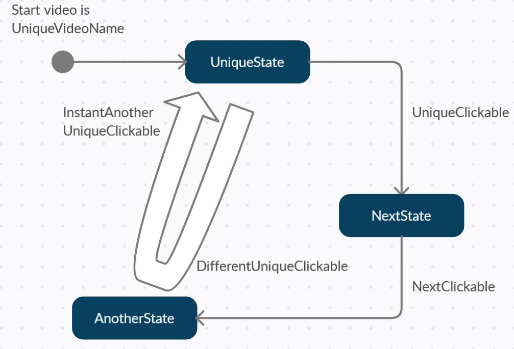

# FmvMaker


FmvMaker was designed for creating FMVs, point'n click adventures, or other types of games/plugins, which use some kind of video playlist with possible interactions. FmvMaker uses only (!) native Unity components to ensure a maximum of compatiblity with all of Unity's supported build platforms. If you encounter errors or problems, pls create a new issue at the github repository. We'll try to help you asap. :)

## Getting started
You can get FmvMaker either via the Unity AssetStore (link-->) or the Releases section of this Github repository. After importing the FmvMaker asset in your Unity project, you'll find a separate FmvMaker folder as subfolder of your Assets folder. The FmvMaker directory contains all necessary data, to get started.

Important for you are the Resources folder (within the FmvMaker folder) where you'll be placing your content (videos, images, etc...) as well as your configuration files. The prefabs folder contains default prefabs, especially for prototyping. In the Scenes folder are demo scenes, to give you an overview of the comprehensive possibilities of FmvMaker.

**VideoData** for FmvMaker is within its Resources folder (e.g. **FmvMakerDemoVideoData.json**) and is basically a JSON list of single video elements, which are qualified via their names. This means that there is no complex hierarchy to build. Please always choose simple, but unique names for your video elements. Every video element stands for its own. You can compare it to some kind of *states*, which will lead to *1 to n* next *states*. The previous *state* doesn't matter at all. Yes, this leads to a long list of elements, but it also helps to keep things simple.

The next kind of important data are so called **Clickables**. Informations about **Clickables** is also stored within the Resources folder in the Unity project in a separate configuration file (e.g. **FmvMakerDemoClickableData.json**). These elements stand for triggering actions when clicking on it. It doesn't matter if these actions are e.g. items or the trigger for the next video. The only difference is the item handling, of which a basic version is already included in FmvMaker and will be explained in the further sections.

## How do I build a video JSON list?
For those who are not familiar with JSON everything you need to know for now is, that there is a certain structure that has to be followed. Everything where a single "Element" (either **VideoData** or **Clickables**) belongs, is represented by …

```
{ [ {...},{...},{...},{...},{...},{...},{...} ] }
```

So there is one pair of curly brackets (one bracket at the beginning and on at the end), which define the scope of all elements. The square brackets represent an array. This array is the collection of either **Video Data** elements or **Clickables**, depending on what file you're creating. Curly brackets, within the square brackets represent the scopre for an item (represented by ...) of the previous defined array. It´s simple right? Usually there is some formatting done, to keep the overview. Like this:
```
{
    [{
        ...
        },{
        ...
        },{
        ...
        },{
        ...
        }
    ]
}
```

Please make sure, you don't forget the brackets in your configuration file!!! There is no JSON error check at the moment (it's on our ToDo list!), so if you're encountering an error, when loading your data it's very likely that you forgot a bracket, or have an issue with the overall sturcture. We'll create a simple prototype called CircleFmv along the next sections. This prototype is also shipped as demo project within FmvMaker.

## What does a “VideoElement” look like?
In this section we'll start to create our configuration file for our **VideoData** as well as our first video element. We'll add data step by step, so pls make sure to follow along and don't skip a section. First create a new file (e.g. DemoVideoData.json), which will hold the **VideoData** information within the FmvMaker/Resources/ folder.

### Basic structure
The version, including a basic structure of our **VideoData** file will look like this:
```javascript
{
  "VideoList": [{
      "Name": "UniqueVideoName",
    }
  ]
}
```

This is the minimum configuration for a single video elememt. It has a *Name* (UniqueVideoTitle), which corresponds to your desired video filename within the Resources folder (within the FmvMaker folder). Please remember to use the filename without the file extension.

The next field is called *IsLooping* and optional. Pls only use this field (and set it to true) if you want to loop your video. This can be useful for parts of your game where you want some background movement, while the player should either look for something or choose the next option (e.g. crossings, dialogues, etc...). A good example for this is a loopable video file, which shows a forest where trees are slightly moving with the wind. If this field is not used or set to false, the video playing atm will stop at the last frame. After reaching this last frame all possible further actions will be presented to the player (which is usually the way traditional FMV games do).

### Add navigation actions
Having the player moving from one to the next video file is made possible via the so called **NavigationTargets**. A video can have *1-n* **NavigationTargets** which are represented as an array of the current video element. This array contains the name/s of the next video/s. Again the name corresponds to your desired video filename within the Resources folder (within the FmvMaker folder). Please remember to use the filename without the file extension. When having multiple names, make that the entries are separated via ,
```javascript
{
  "VideoList": [{
      "Name": "UniqueVideoName",
      "NavigationTargets": [{
          "Name": "NextUniqueClickable"
        }, {
          "Name": "AnotherUniqueClickable"
        }
      ]
    }
  ]
}
```

Each name used as **NavigationTarget** must have it's own **Clickable** within our **Clickables** configuration file. Similar to our first video element, the additional video elements can also reference **NagivationTargets**.

Let's try to build a circle, where our player can move from **UniqueVideoName** to **NextUniqueVideoName**. From there to **AnotherUniqueVideoName** and from **AnotherUniqueVideoName** back to **UniqueVideoName**. A simple circular video route through our game. Pls note that neede the **Clickables** will be created within the next sections.
```javascript
{
  "VideoList": [{
      "Name": "UniqueVideoName",
      "NavigationTargets": [{
          "Name": "UniqueClickable"
        }
      ]
    }, {
      "Name": "NextUniqueVideoName",
      "NavigationTargets": [{
          "Name": "NextUniqueClickable"
        }
      ]
    }, {
      "Name": "AnotherUniqueVideoName",
      "NavigationTargets": [{
          "Name": "AnotherUniqueClickable"
        }
      ]
    }
  ]
}
```

## What does a “ClickableElement” look like?
In this section we'll start to create our configuration file for our **Clickables** as well as reference our video elements to our **Clickables**. We'll add data step by step, so pls make sure to follow along and don't skip a section.

### Add Clickable data
After defining our video route, we'll need **Clickables** to navigate through our defined route. This will we configured in our **Clickables** configuration file. Create a new file (e.g. DemoClickableData.json), which will hold the **Clickables** information within the FmvMaker/Resources/ folder. A basic structure with one **Clickable** element will look like this:
```javascript
{
  "ClickableList": [{
      "Name": "ClickableMe",
      "Description": "Fancy, but short description.",
      "PickUpVideo": "WhichVideoToPlayOnClick",
      "IsNavigation": true,
      "RelativeScreenPosition": {
        "x": 0.5,
        "y": 0.2
      }
    }
  ]
}
```

| Field | Type | Default value | Optional | Description |
| --- | --- | --- | --- | --- |
| Name | string | "" | | Similar to our **VideoData** the **Clickables** also need a unique name, which is set via the *Name* field. |
| Description | string | "" | x | The *Description* will help to identify the usage. |
| PickUpVideo | string | "" | | *PickUpVideo* will refer to the video element to play, when the player clicks on this **Clickable**. The refered video element must exist with the same name within the **VideoData** configuration file. |
| IsNavigation | bool | false | | *IsNavigation* helps to distinguish between pure navigation and collectable items. The item section will explain this in more detail. |
| RelativeScreenPosition | Vector2 | x=0.5, y=0.5 | x| Last but not least, the *RelativeScreenPosition* will define where this **Clickable** will be shown on screen. Pls make sure to only use values between 0 and 1, where x=0, y=0 refers to the lower left corner, x=0.5,y=0.5 to the center (default) and x=1, y=1 to the upper right corner. | 

If you're not providing optional fields, FmvMaker will use the default value. When now taking our already defined video data, we can now create the **Clickables**, which will result in a **Clickables** configuration file with the following content (Pls note that the *RelativeScreenPosition* was not filled in the third **Clickable** to show you the usage of the default values):
```javascript
{
  "ClickableList": [{
      "Name": "UniqueClickable",
      "Description": "Go to NextUniqueVideo.",
      "PickUpVideo": "NextUniqueVideoName",
      "IsNavigation": true,
      "RelativeScreenPosition": {
        "x": 0.8,
        "y": 0.2
      }
    }, {
      "Name": "NextUniqueClickable",
      "Description": "Go to AnotherUniqueVideo.",
      "PickUpVideo": "AnotherUniqueVideoName",
      "IsNavigation": true,
      "RelativeScreenPosition": {
        "x": 0.2,
        "y": 0.5
      }
    }, {
      "Name": "AnotherUniqueClickable",
      "Description": "Go to UniqueVideo.",
      "PickUpVideo": "UniqueVideoName",
      "IsNavigation": true
    }
  ]
}
```

## Enough explanation, can't we start already?
YES, we can. With the example from the previous section you've already created a simple prototype, which will allow us to navigate between video elements. If you want to use your own .mp4 videos, just copy them into the FmvMaker/Resources/FmvMakerVideos and replace their file names (without extension) in the **VideoData** configuration file. For the final touches, open Unity and open the EmptyFmv scenes, located in FmvMaker/Scenes. After selecting the FmvHelper GameObject in the hierarchy, drag the created JSON files into their corresponding fields of the FmvData component.



Select the FmvVideoObject and set the field "Name Of Start Video" to the filename (without file extension) of the video which you want to be the initial/start video. This data can also be changed later, to react to the players progress.



Press play in Unity Editor and watch your **VideoData** play and interact with your configured **Clickables** to navigate. A predefined project (CircleFmv), which is based on the previous sections is also shipped with the FmvMaker package. To give you a better understanding, of how this behaviour works in this example, pls have a look at the following "state diagram".



## Advanced video navigation
The previous sections showed how to create a very simple FMV game. But FmvMaker will enable you to create far more complex games. 

### Multiple NavigationTargets in one screen
As you may already have noticed, each **VideoData** element has the possility to hold multiple **NavigationTargets**. The JSON array will accept multiple **Clickables**, as long as they are present in the **Clickables** configuration file.

You can either reuse already existing **Clickables** or create new ones. This may greatly depend on your game and design. For our example, we'll just add another **NavigationTarget** to our first video element and create a new **Clickable** (DifferentUniqueClickable). I'm sure you already guessed, that we'll need an additional video element to configure the movement from UniqueVideoName to AnotherUniqueVideoName. So we'll need to create a new element of **VideoData** and a new **Clickable**.

The new **VideoData** element (DifferentUniqueVideoName) will basically be the same like the AnotherUniqueVideoName video element, except for the linked video file. This kind of "duplication" behaviour is intended to give you the greatest possible flexibility, when configuring your game. E.g. the **NavigationTargets** can differ, depending on which route the player chooses, to get to his destination. Let's see how an full configuration example looks, based on our CircularFmv prototype:
```javascript
{
  "VideoList": [{
      "Name": "UniqueVideoName",
      "NavigationTargets": [{
          "Name": "UniqueClickable",
          "Name": "DifferentUniqueClickable"
        }
      ]
    }, {
      "Name": "NextUniqueVideoName",
      "NavigationTargets": [{
          "Name": "NextUniqueClickable"
        }
      ]
    }, {
      "Name": "AnotherUniqueVideoName",
      "NavigationTargets": [{
          "Name": "AnotherUniqueClickable"
        }
      ]
    }, {
      "Name": "DifferentUniqueVideoName",
      "NavigationTargets": [{
          "Name": "AnotherUniqueClickable"
        }
      ]
    }
  ]
}
```
```javascript
{
  "ClickableList": [{
      "Name": "UniqueClickable",
      "Description": "Go to NextUniqueVideo.",
      "PickUpVideo": "NextUniqueVideoName",
      "IsNavigation": true,
      "RelativeScreenPosition": {
        "x": 0.8,
        "y": 0.2
      }
    }, {
      "Name": "NextUniqueClickable",
      "Description": "Go to AnotherUniqueVideo.",
      "PickUpVideo": "AnotherUniqueVideoName",
      "IsNavigation": true,
      "RelativeScreenPosition": {
        "x": 0.2,
        "y": 0.5
      }
    }, {
      "Name": "AnotherUniqueClickable",
      "Description": "Go to UniqueVideo.",
      "PickUpVideo": "UniqueVideoName",
      "IsNavigation": true
    }, {
      "Name": "DifferentUniqueClickable",
      "Description": "Go to AnotherUniqueVideo.",
      "PickUpVideo": "DifferentUniqueVideoName",
      "IsNavigation": true,
      "RelativeScreenPosition": {
        "x": 0.2,
        "y": 0.2
      }
    }
  ]
}
```

Our "state diagram" has now changed to this:


### Instant NavigationTargets
Sometimes you want to jump from video element directly to another, without letting the user decide where to go. This can be useful in storytelling to avoid dead ends, or go quickly back to a video element from where the player can continue. Usually you'd record a video, which shows everything, but as things can become complex and you'll have to somehow have to combine videos, without shipping them multiple times with your projects, "Instant **NavigationTargets** can be rather useful. Let's take our CircleFmv prototype and replace our AnotherUniqueClickable & DifferentUniqueClickable with an "Instant **NavigationTarget**". A possible for this behavour may be to show the player, that he'll have to approach AnotherUniqueVideoName by a different route.
```javascript
{
  "VideoList": [{
      "Name": "UniqueVideoName",
      "NavigationTargets": [{
          "Name": "UniqueClickable",
          "Name": "DifferentUniqueClickable"
        }
      ]
    }, {
      "Name": "NextUniqueVideoName",
      "NavigationTargets": [{
          "Name": "NextUniqueClickable"
        }
      ]
    }, {
      "Name": "AnotherUniqueVideoName",
      "NavigationTargets": [{
          "Name": "AnotherUniqueClickable"
        }
      ]
    }, {
      "Name": "DifferentUniqueVideoName",
      "NavigationTargets": [{
          "Name": "InstantAnotherUniqueClickable"
        }
      ]
    }
  ]
}
```
```javascript
{
  "ClickableList": [{
      "Name": "UniqueClickable",
      "Description": "Go to NextUniqueVideo.",
      "PickUpVideo": "NextUniqueVideoName",
      "IsNavigation": true,
      "RelativeScreenPosition": {
        "x": 0.8,
        "y": 0.2
      }
    }, {
      "Name": "NextUniqueClickable",
      "Description": "Go to AnotherUniqueVideo.",
      "PickUpVideo": "AnotherUniqueVideoName",
      "IsNavigation": true,
      "RelativeScreenPosition": {
        "x": 0.2,
        "y": 0.5
      }
    }, {
      "Name": "AnotherUniqueClickable",
      "Description": "Go to UniqueVideo.",
      "PickUpVideo": "UniqueVideoName",
      "IsNavigation": true
    }, {
      "Name": "DifferentUniqueClickable",
	  "Description": "Go to AnotherUniqueVideo.",
      "PickUpVideo": "DifferentUniqueVideoName",
      "IsNavigation": true,
      "RelativeScreenPosition": {
        "x": 0.2,
        "y": 0.2
    }, {
      "Name": "InstantAnotherUniqueClickable",
      "PickUpVideo": "UniqueVideoName",
        "IsNavigation": true
      }
    }
  ]
}
```
Our "state diagram" has now changed to this:


### Loopable video elements

## Use Clickable Items to enhanced your game

### Multiple Items in one screen

### Items to find

### Items to use

## Key bindings and already implemented game mechanics

## Use icons for NavigationTargets and Items

## The full VideoData API
```javascript
{
  "VideoList": [{
      "Name": "UniqueVideoName",
      "IsLooping": true,
      "NavigationTargets": [{
          "Name": "Up"
        }, {
          "Name": "Left"
        }, {
          "Name": "Right"
        }, {
          "Name": "Down"
        }
      ],
      "ItemsToFind": [{
          "Name": "apple"
        }, {
          "Name": "coins"
        }, {
          "Name": "Meat"
        }
      ],
      "ItemsToUse": [{
          "Name": "bag"
        }
      ],
      "AlreadyWatched": false,
      "DisplayText": "DisplayText",
      "RelativeScreenPosition": {
        "x": 0,
        "y": 0
      }
    }
  ]
}
```
| Field | Type | Default value | Optional | Description |
| --- | --- | --- | --- | --- |
| Name | string | "" | | The video element need a unique name, which is set via the *Name* field. |
| IsLooping | bool | false | x | The *IsLooping* field can be used to create a looped video state, when set to true. This gives the player a better idea of the scenes by showing various impressions. E.g. wind movement, lively places, traffic, etc… Pls make sure to use loopable videos when using this property. If this field is not used or set to false, the video playing atm will stop at the last frame. After reaching this last frame all possible further actions (**NavigationTargets**, **ItemsToFind**) will be presented to the player (which is usually the way traditional FMV games do).|
| NavigationTargets | string[] | [] | | A video can have *1-n* **NavigationTargets** which are represented as an array of the current video element. This array contains the name/s of the next video/s. Again the name corresponds to your desired video filename within the Resources folder (FmvMaker/Resources/FmvMakerVideos). Please remember to use the filename without the file extension. When having multiple names, make that the entries are separated via , |
| ItemsToFind | string[] | [] | | *ItemsToFind* references all items **Clickables** which can be found within this video element. |
| ItemsToUse | string[] | [] | | *ItemsToFind* references all items **Clickables** which can be used within this video element. To use items, they have to be found first. |
| AlreadyWatched | bool | false | x | *AlreadyWatched* checks if a video was already watched. Players can skip already watched videos by pressing a predefined key. This field should NOT be used within your configuration files. |
| DisplayText | string | "" | x | *DisplayText* does what it name says. It shows a set text. This field should NOT be used within your configuration files. |
| RelativeScreenPosition | Vector2 | x=0.5, y=0.5 | x| The *RelativeScreenPosition* should NOT be used within your video configuration file. This field is reserved for further useage to display multiple videos at once. | 

## The full Clickable API
```javascript
{
  "ClickableList": [{
      "Name": "ClickableMe",
      "Description": "Description? Try this.",
      "PickUpVideo": "UniqueVideoName",
      "UseageVideo": "AnotherUniqueVideoName",
      "IsNavigation": false,
      "IsInInventory": false,
      "WasUsed": false,
      "DisplayText": "Delicious apple",
      "RelativeScreenPosition": {
        "x": 0.2,
        "y": 0.8
      }
    }
  ]
}
```
| Field | Type | Default value | Optional | Description |
| --- | --- | --- | --- | --- |
| Name | string | "" | | The **Clickable** needs a unique name, which is set via the *Name* field. |
| Description | string | "" | x | *Description* does what it name says. It shows a set text, maybe as tooltip or something similar. When dealing with an instant **NavigationTarget** this field can be omited, to tell FmvMaker that the next video (linked in *PickUpVideo*) should be instantly played. |
| PickUpVideo | string | "" |  | The *PickUpVideo* field links to the video element, which should be played, when this **Clickable** item is selected.|
| UseageVideo | string | "" | | The *UseageVideo* field links to the video element, which should be played, when this **Clickable** item is selected from the inventory in the correct screen. That means this **Clickable** must be referenced as a *ItemToUse* in the current video element. |
| IsNavigation | bool | false | x | *IsNavigation* helps to distinguish between pure navigation and collectable items. It it's true, the **Clickable** will be used as a **NavigationTarget**. It it's set to false, or the default value is used (by omiting this field), this **Clickable** will be an item. |
| IsInInventory | bool | false | x | *IsInInventory* checks if this item was already collected or not. It can be used to track the players progress, or preload certain items for the players inventory. |
| WasUsed | bool | false | x | *WasUsed* checks if item was already used, like intended. Items where this property is true, will not be loaded by FmvMaker. This can be useful for either testing, or tracking player progress. |
| DisplayText | string | "" | x | *DisplayText* does what it name says. It shows a set text. This field should NOT be used within your configuration files. |
| RelativeScreenPosition | Vector2 | x=0.5, y=0.5 | x| The *RelativeScreenPosition* places your **Clickable** on the designated screen position. Pls make sure to only use values between 0 and 1, where x=0, y=0 refers to the lower left corner, x=0.5,y=0.5 to the center (default) and x=1, y=1 to the upper right corner. | 

## Adding your own logic
A more sophisticated example is shipped with the demo project.

## Future plans
- [ ] There is already a possility to use events, provided by FmvMaker. We'll extend them in future versions, to give you more possibilties to configure everything for your needs.
- [ ] We're already working on a JSON checker, to display possible errors, when reading to configuration files. 
- [ ] Another extension on our ToDo list is a node-based editor window, to omit the troublesome configuration file writing and make it easier to create your project (like Bolt, VFX graph, etc...). 
- [ ] Including online videos, as well as locally (outside of Unity) stored videos will also be possible soon.
- [ ] Including online images, as well as locally (outside of Unity) stored images will also be possible soon.
- [ ] Show multiple videos at the same time, to create a a video matrix. Rare useage, but it's fancy.
- [ ] FmvMaker currently only supports Unitys UI sytstem. We're working on TextMeshPro support.

## Known issues
* FmvMaker only supports video files, which are supported by Unity (link to Unity docs). Our recommendation: Pls try to use .mp4 files.
* It's not possible to edit or transform videos within Unity. Pls use an external video editor like Shotcut (https://shotcut.org/) to prepare your videos for use with FmvMaker.
